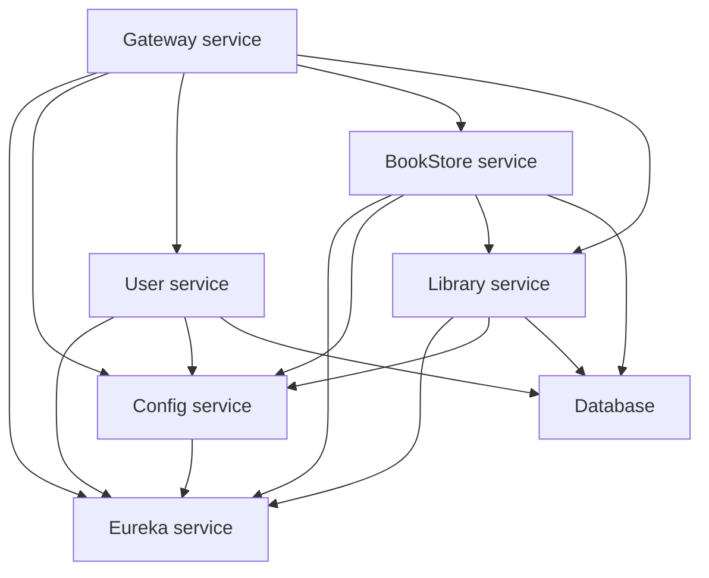

# Modsen test task (Library Application)

## Description

This is a repo for a library application. The application is a simple library management system that
allows users to add, edit, and delete books, authors and book leases.

### Stack

- Java 17
- Spring Boot
- Spring Data JPA
- Spring Cloud Gateway
- Spring Cloud Config
- Spring Cloud Eureka
- Spring Security
- PostgreSQL
- Lombok
- ModelMapper
- JWT
- Docker
- Docker Compose
- Gradle

### Microservices

- User Service
- BookStore Service
- Library Service (responsible for leases)
- Config Service
- Eureka Service
- Gateway Service

Dependencies are shown below:



## How to run

This project uses Docker with Docker Compose to run the services. To run the application, follow the
steps below:

1. Clone the repository
2. Run the following command in the root directory of the project:

```shell
docker-compose up
```

This command will start all the services and the application entry point will be available at
`http://localhost:8083`.

> Note: It may take some time before services start to work correctly (and gateway start responding correctly)
> due to the time needed for services to register in Eureka and other to catch this up.

Microservices themselves will be available at the following ports:

- Eureka: `http://localhost:8761`
- Config: `http://localhost:8888`
- Gateway: `http://localhost:8083`
- User: `http://localhost:8081`
- BookStore: `http://localhost:8080`
- Library: `http://localhost:8082`
- Database (PostgreSQL): `psql://localhost:5432`

## API Documentation

Global (exposed) API documentation is available as OpenAPI [specification](./openapi.yaml).
Individual services may also have API endpoints intended for application-internal (between
microservices) use. They are available in the `internal.yaml` files in service roots.

## Security

The application uses JWT for authentication. To access the application, you need to provide a valid
JWT token in the `Authorization` header. The token can be obtained by first creating the user (`PUT /users`, this endpoint is not protected)
and later logging in (`POST /auth/login`) receiving the token in the response body.

## Configuration

Configuration for services is stored in [configuration](./configuration) directory. Each service has its own configuration file.

## License

This project is licensed under the most restrictive license of its dependencies. Please refer to the
dependencies' licenses for more information.